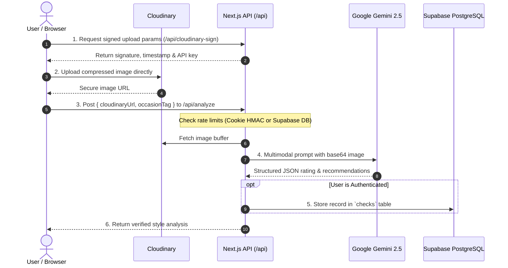

# FitCheck — AI Fashion Intelligence & Outfit Rating System

FitCheck is an AI-powered styling assistant that analyzes your outfit photos, delivers color harmony breakdowns, evaluates occasion suitability, and provides actionable wardrobe swap recommendations.

**Live App**: [FitCheck](https://fitcheck-x.vercel.app/)

<p align="left">
  
</p>

---

## Screenshots

<p align="center">
  
  
</p>

---

## Features

- **Multimodal AI Fashion Analysis** — Powered by Google Gemini Vision to evaluate fabric textures, silhouettes, footwear, and accessory pairings.
- **Granular Scored Breakdown** — Generates an overall style rating (0.0 – 10.0), color harmony rating, and occasion suitability score.
- **Smart Swap Recommendations** — Highlights specific clashing items or footwear mismatches with actionable, concrete styling fixes.
- **Occasion-Aware Intelligence** — Tailor the evaluation for specific contexts (Casual, Formal, Date Night, Streetwear, Business Casual, Gym/Athletic, Party) or let the AI auto-detect.
- **Direct Signed Image Uploads** — Client-side compression paired with server-signed Cloudinary uploads keeps serverless function execution fast and lightweight.
- **Dynamic Social Share Cards** — Instant 9:16 (Story) and 4:5 (Post) graphic generation powered by `@vercel/og` edge rendering.
- **Lookbook & History Tracker** — Authenticated users can review past checks, track their average styling scores, and celebrate their personal bests.
- **Dual-Tier Rate Limiting** — Secure cryptographic guest cookies (2 free checks) and daily database quotas for registered members (5 checks/day resetting at midnight UTC).
- **Mobile-First & Camera Ready** — Seamlessly snap photos via integrated webcam/device camera or drag-and-drop from your camera roll.

---

## How It Works



---

## Tech Stack

| Layer                | Technology                                                                    | Details                                                       |
| :------------------- | :---------------------------------------------------------------------------- | :------------------------------------------------------------ |
| **Framework**        | [Next.js 16](https://nextjs.org/)                                             | App Router, Server Actions, Route Handlers                    |
| **Frontend**         | [React 19](https://react.dev/), [TypeScript](https://www.typescriptlang.org/) | Modern hooks, strict typing, responsive design                |
| **Styling**          | [Tailwind CSS v4](https://tailwindcss.com/)                                   | Custom design tokens, dark aesthetic, CSS keyframe animations |
| **AI Vision Engine** | [Google Gemini 2.5 Flash](https://aistudio.google.com/)                       | High-speed multimodal visual comprehension (`@google/genai`)  |
| **Database & Auth**  | [Supabase](https://supabase.com/)                                             | PostgreSQL, Row Level Security (RLS), `@supabase/ssr` auth    |
| **Media Pipeline**   | [Cloudinary](https://cloudinary.com/)                                         | Cloud storage with server-side HMAC signature verification    |
| **Compression**      | `browser-image-compression`                                                   | In-browser downsampling prior to upload                       |
| **OG Card Engine**   | `@vercel/og`                                                                  | Edge runtime social card composition                          |

---

## Project Structure

```
fitcheck/
├── public/                     # Static assets, SVG icons, and logo
├── src/
│   ├── app/
│   │   ├── (auth)/             # Authentication routes (login, signup, reset password)
│   │   ├── actions/auth.ts     # Supabase Server Actions for authentication
│   │   ├── api/
│   │   │   ├── analyze/        # Gemini AI prompt orchestration & rate limiting
│   │   │   ├── cloudinary-sign/# Server-side signed upload signature generator
│   │   │   └── share-card/     # Edge OG social media story/post renderer
│   │   ├── auth/callback/      # OAuth & email verification callback handler
│   │   ├── check/              # Main outfit upload & webcam inspection interface
│   │   ├── history/            # Personal lookbook history & outfit archive
│   │   ├── layout.tsx          # Root layout with navigation and global theme
│   │   ├── page.tsx            # Landing page with feature highlights
│   │   └── globals.css         # Typography, CSS variables, and animation utilities
│   ├── components/
│   │   ├── auth/               # Auth form UI and handlers
│   │   ├── history/            # History cards and empty state components
│   │   ├── layout/             # Navigation bar and logout trigger
│   │   ├── results/            # Score rings, harmony badges, swap cards, share modal
│   │   └── upload/             # Drag-and-drop upload zone, webcam capture, occasion picker
│   ├── lib/
│   │   ├── supabase/           # Server, client, and admin Supabase instances
│   │   ├── cloudinary.ts       # Cloudinary SDK config & signature generation
│   │   ├── guest-cookie.ts     # Cryptographic HMAC-SHA256 guest rate limiter
│   │   ├── types.ts            # Shared TypeScript interfaces & types
│   │   └── validate-url.ts     # Domain whitelist validator for uploaded assets
│   └── proxy.ts                # Edge session refresher
├── .env.example                # Sanitized environment variable template
├── package.json
└── vercel.json                 # Serverless function execution timeout config
```

---

## Getting Started

Follow these steps to set up and run FitCheck locally.

### Prerequisites

- **Node.js**: `v18.18.0` or later (Node.js 20+ recommended)
- **npm**, **yarn**, **pnpm**, or **bun**
- A free [Supabase](https://supabase.com/) account
- A free [Google AI Studio](https://aistudio.google.com/) account (for Gemini API)
- A free [Cloudinary](https://cloudinary.com/) account

---

### Step 1 — Clone the Repository

```bash
git clone https://github.com/flowstxte/fitcheck.git
cd fitcheck
```

### Step 2 — Install Dependencies

```bash
npm install
```

### Step 3 — Configure Environment Variables

Create your local environment file by copying the template:

```bash
cp .env.example .env.local
```

Fill in your `.env.local` with your service credentials:

```env
# Supabase
NEXT_PUBLIC_SUPABASE_URL=https://your-project.supabase.co
NEXT_PUBLIC_SUPABASE_ANON_KEY=your-supabase-anon-key
SUPABASE_SERVICE_ROLE_KEY=your-supabase-service-role-key

# Cloudinary
CLOUDINARY_CLOUD_NAME=your-cloud-name
CLOUDINARY_API_KEY=your-cloudinary-api-key
CLOUDINARY_API_SECRET=your-cloudinary-api-secret

# Google Gemini API
GEMINI_API_KEY=your-gemini-api-key

# Guest Rate Limiting Secret
COOKIE_SECRET=generate-a-random-32-byte-hex-string

# Site URL
NEXT_PUBLIC_SITE_URL=http://localhost:3000
```

---

### Step 4 — Set Up Supabase (Database & Auth)

1. Go to [Supabase](https://supabase.com/) and create a new project.
2. In the Supabase dashboard, navigate to **Authentication** > **URL Configuration**:
   - Set **Site URL** to: `http://localhost:3000`
   - Add **Redirect URL**: `http://localhost:3000/auth/callback`
     _(In production, add your production domain, e.g. `https://your-domain.vercel.app/auth/callback`)_
3. Navigate to the **SQL Editor** in the Supabase dashboard, paste the following SQL script, and click **Run**:

```sql
-- 1. Create the `checks` table
create table public.checks (
  id uuid primary key default gen_random_uuid(),
  user_id uuid references auth.users(id) on delete cascade not null,
  cloudinary_url text not null,
  ai_result jsonb not null,
  occasion_tag text,
  created_at timestamptz default now() not null
);

-- 2. Create performance indexes
create index idx_checks_user_id on public.checks(user_id);
create index idx_checks_user_created_at on public.checks(user_id, created_at desc);

-- 3. Enable Row Level Security (RLS)
alter table public.checks enable row level security;

-- 4. Create RLS Policies
create policy "Users can view their own checks"
  on public.checks for select
  using (auth.uid() = user_id);

create policy "Users can insert their own checks"
  on public.checks for insert
  with check (auth.uid() = user_id);

create policy "Users can delete their own checks"
  on public.checks for delete
  using (auth.uid() = user_id);
```

4. Retrieve your keys from **Project Settings** > **API**:
   - Project URL → `NEXT_PUBLIC_SUPABASE_URL`
   - `anon` `public` key → `NEXT_PUBLIC_SUPABASE_ANON_KEY`
   - `service_role` `secret` key → `SUPABASE_SERVICE_ROLE_KEY`

---

### Step 5 — Set Up Cloudinary

1. Sign up or log into [Cloudinary](https://cloudinary.com/).
2. From the Cloudinary Dashboard / Console Settings, retrieve:
   - **Cloud Name** → `CLOUDINARY_CLOUD_NAME`
   - **API Key** → `CLOUDINARY_API_KEY`
   - **API Secret** → `CLOUDINARY_API_SECRET`
3. _Note_: FitCheck uses server-side signing (`api_sign_request`). No unsigned upload presets are needed, ensuring that only authenticated client requests can upload images into the designated `fitcheck/` folder.

---

### Step 6 — Set Up Google Gemini API

1. Visit [Google AI Studio](https://aistudio.google.com/app/apikey).
2. Create or select a Google Cloud project and click **Create API key**.
3. Copy the key and assign it to `GEMINI_API_KEY` in your `.env.local`.

---

### Step 7 — Generate a Cookie Secret

Generate a cryptographically random 32-byte hexadecimal string for signing guest session cookies:

```bash
node -e "console.log(require('crypto').randomBytes(32).toString('hex'))"
```

Paste the output into your `.env.local` as `COOKIE_SECRET`.

---

### Step 8 — Run the Development Server

```bash
npm run dev
```

Open [http://localhost:3000](http://localhost:3000) in your browser.

---

## Production Build & Deployment

### Build Locally

To test the production build locally:

```bash
npm run build
npm run start
```

### Deploy to Vercel

1. Push your repository to GitHub.
2. Import the project into [Vercel](https://vercel.com/).
3. In the project settings, configure all environment variables listed in `.env.example`.
4. Ensure `NEXT_PUBLIC_SITE_URL` points to your production domain (e.g. `https://fitcheck-x.vercel.app`).
5. Update your Supabase Auth **Site URL** and **Redirect URLs** to include your Vercel production domain.
6. Deploy! The `vercel.json` configuration automatically adjusts serverless function timeouts (`maxDuration: 60`) for Gemini Vision processing.

---

## Security & Privacy Notice

- **No Hardcoded Secrets**: All API keys, service role credentials, and HMAC signing keys are loaded through environment variables.
- **Server Isolation**: Sensitive credentials (`GEMINI_API_KEY`, `SUPABASE_SERVICE_ROLE_KEY`, `CLOUDINARY_API_SECRET`, and `COOKIE_SECRET`) are strictly read in server-side API routes and Server Actions. They are never bundled into client-side JavaScript.
- **Signed Direct Uploads**: Upload parameters are generated server-side with short-lived timestamps, preventing unauthorized uploads or tampering with asset folders.
- **SSRF & Asset Validation**: URLs submitted for analysis are verified via hostname and folder whitelist before processing (`src/lib/validate-url.ts`).

---

## Contributing

Contributions, issues, and feature requests are welcome!

1. Fork the project
2. Create your feature branch (`git checkout -b feature/AmazingFeature`)
3. Commit your changes (`git commit -m 'Add some AmazingFeature'`)
4. Push to the branch (`git push origin feature/AmazingFeature`)
5. Open a Pull Request

---

## License

This project is licensed under the MIT License — see the [LICENSE](LICENSE) file for details.
